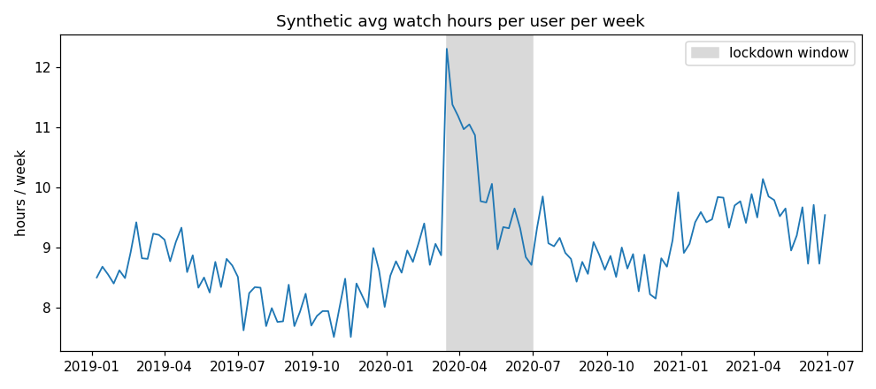
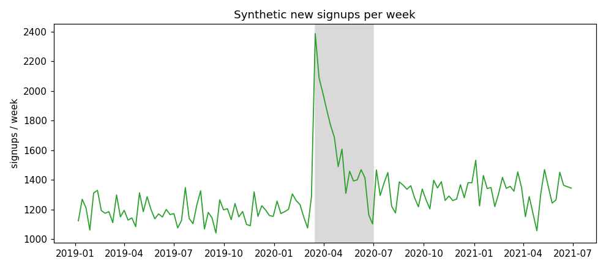
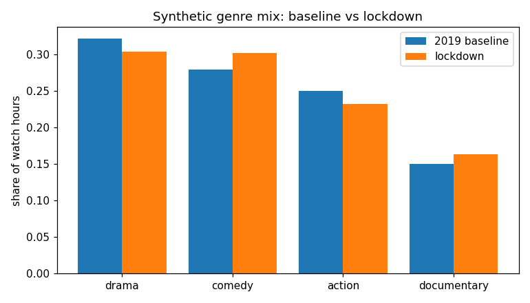

# Did streaming behavior change during COVID?

A small pre/post analysis of streaming behavior around the 2020 lockdowns,
written as a course style case summary. The dataset is **synthetic**, built
to demonstrate the analytical design. It is not Netflix data and it proves
nothing about real viewers.

## The question

When lockdowns hit in March 2020, the intuition was obvious: people stuck at
home would watch more. The interesting analytical work is turning that
intuition into testable claims and knowing what the numbers cannot tell you.

## How I thought about it

**1. Split one vague question into three hypotheses.**
"Did behavior change" is not testable. Three versions are: H1, average watch
time per user rose during lockdowns; H2, new signups spiked; H3, the genre
mix shifted toward comfort viewing (comedy, documentary) and away from
heavier genres. Each hypothesis names its own metric before I touch the
data.

**2. Pick the comparison windows deliberately.**
A pre/post design needs a baseline that is not contaminated by the event.
I used all of 2019 as the baseline, March 16 to June 30 2020 as the
lockdown window, and the first half of 2021 as a later check. The 2021
window matters: if behavior snaps back, the change was situational; if it
stays elevated, something may have shifted structurally.

**3. Expect the confounders and say them out loud.**
A pre/post comparison has no control group. Seasonality, new show releases,
and everything else that happened in 2020 ride along in the numbers. So the
output reports means and percent changes, and stops there. No causal claim,
no p values dressed up as proof.

**4. Let the chart carry the shape, the table carry the size.**
The time series shows when the change starts and whether it fades. The
period means quantify it. One without the other invites misreading.

## What the synthetic example shows

| Metric | 2019 baseline | Lockdown | 2021 |
| --- | --- | --- | --- |
| Avg hours per user per week | 8.40 | 10.09 (+20.2%) | 9.49 (+12.9%) |
| New signups per week | 1,183 | 1,600 (+35.2%) | 1,326 (+12.0%) |

Genre mix also tilts during lockdown: comedy 27.9% to 30.2%, documentary
15.0% to 16.4%, with drama and action giving up share. In this illustration
the elevation partly persists into 2021.







## What is in here

* `scripts/generate_data.py` — builds the synthetic weekly panel (seeded,
  reproducible) into `data/synthetic_weekly.csv`
* `scripts/analyze.py` — period comparisons and charts; rerunnable
* `data/synthetic_weekly.csv` — 130 synthetic weeks, Jan 2019 to Jun 2021
* `charts/` — the three figures above

## Run it

```bash
pip install -r requirements.txt
python3 scripts/generate_data.py   # optional: regenerates the synthetic CSV
python3 scripts/analyze.py
```

## What this does not do

This is a methods illustration on invented data. A real version would need
account level viewing records, a way to separate new demand from pulled
forward demand, and ideally a comparison group untouched by lockdowns. None
of that exists here, and the README says so on purpose: the discipline of
the writeup is the skill being shown.
